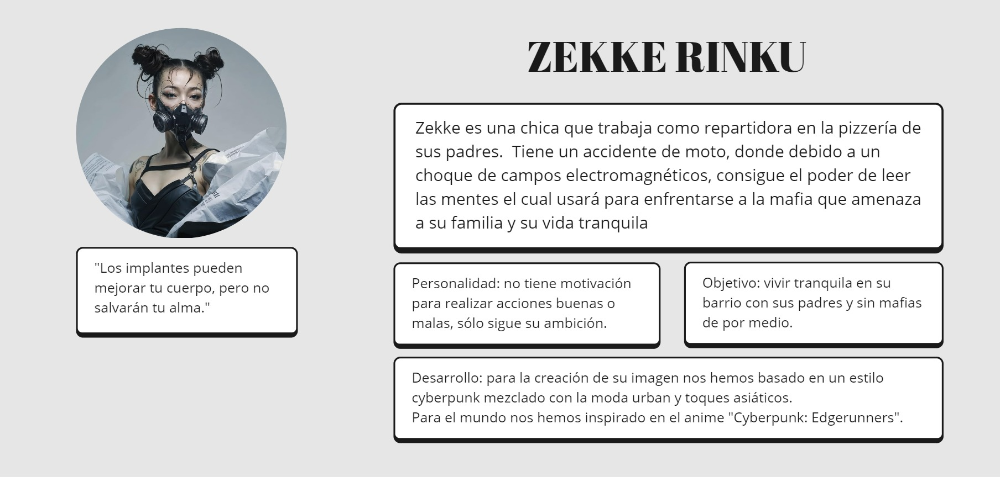

# (Nombre da la historia):
### Las mentiras y el silencio no sirven contra su mente, el dinero sí
Autores
- :woman: Natalia Cantero Salinas
- :man: Álvaro Las Heras García
- :man: Sergio Manzano Martín
- :woman: Darlyn Pérez González

Tipo/Género:  
- [x] FictionCiberpunk  
- [ ] Reality/tribus urbanas  
- [ ] Comic

## Resumen
Zekke es una chica que trabaja como repartidora en la pizzería de sus padres. En un reparto tiene un accidente de moto donde, debido a un choque de campos electromagnéticos, consigue el poder de leer las mentes. Ella usará este poder para enfrentarse a la mafia que amenaza a su familia y su vida pacífica en el Akihabara de 2099.

### Personaje

### Historia

### Contexto

### Conflicto

### Test de Personalidad

### Conclusiones y Valoración del Equipo

------
Marzo, 2025

Proyecto dentro de la serie [Narrativas interactivas](https://github.com/mgea/storytelling/blob/master/What_is_a_digital_storytelling.md) 
Proyectos seleccionados de [2024](https://github.com/mgea/storytelling/tree/master/2024), [2023](https://github.com/mgea/storytelling/tree/master/2023), [2022](https://github.com/mgea/storytelling/blob/master/2022/readme.md) / [2021](https://github.com/mgea/storytelling/blob/master/2021/readme.md) / [2020](https://github.com/mgea/storytelling/blob/master/2020/readme.md)  / 
[2019](https://github.com/mgea/storytelling/blob/master/2019/readme.md) / [2018](https://github.com/mgea/storytelling/blob/master/2018/readme.md) 

CC BYNCSA [Creatividad e Innovación Audiovisual-B](https://github.com/mgea/criav/)
 

[Facultad de Comunicación y Documentación](http://fcd.ugr.es)

Universidad de Granada
